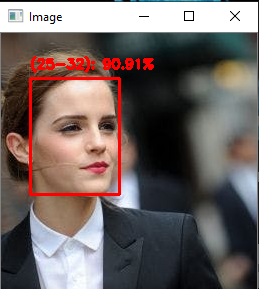
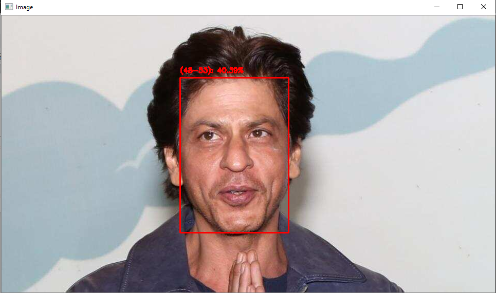

# Age-Detector

Built an age detector using CNN and Open CV. I have used Adience Dataset to train the model. The model classifies into a total of eight age brackets:

1. 0-2

2. 4-6

3. 8-12

4. 15-20

5. 25-32

6. 38-43

7. 48-53

8. 60-100





# Steps to run the project

1. The model is already trained. All you need to do is download the repository and run the file.

2. If u wish to detect age of a image run the following code in your preferred ide
```
%run detect_age.py --image img.jpg --face face_detector --age age_detector
```

3. If u wish to detect age of a person using video camera of ur system run the following code
```
%run detect_age_video.py --face face_detector --age age_detector
```

